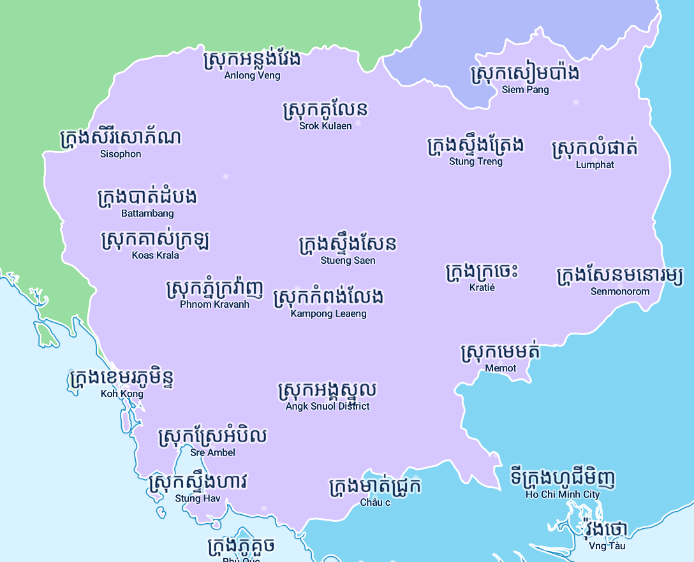

# Khmer Map Labels

https://wipfli.github.io/khmer-map-labels/

<a href="https://wipfli.github.io/khmer-map-labels/"></a>

## Steps

Get `cities.geojson` from overpass-turbo.eu.

```
python3extract_labels.py
```

```
cp labels.json ../font-maker/raqm
```

assumes you have font-maker with the indexed-font branch in the neighboring folder

https://github.com/wipfli/font-maker/tree/indexed-font

```
cd ../font-maker/raqm
python3 shape.py
cd ..
./run.sh
cd ../khmer-map-labels
cp -r ../font-maker/output_dir .
cp ../font-maker/raqm/encoded_labels.json .
python3 feed_back_encoding.py
```


